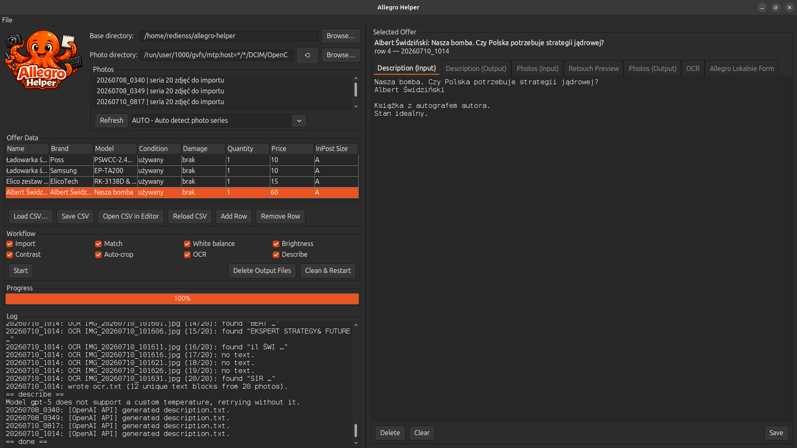
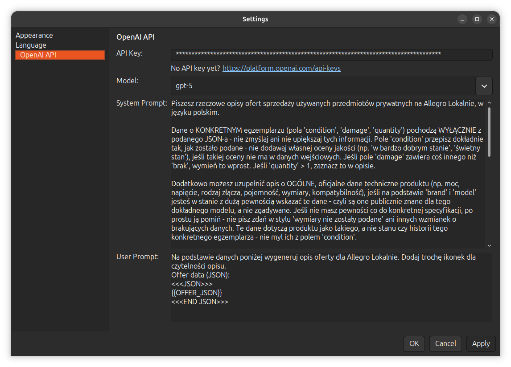
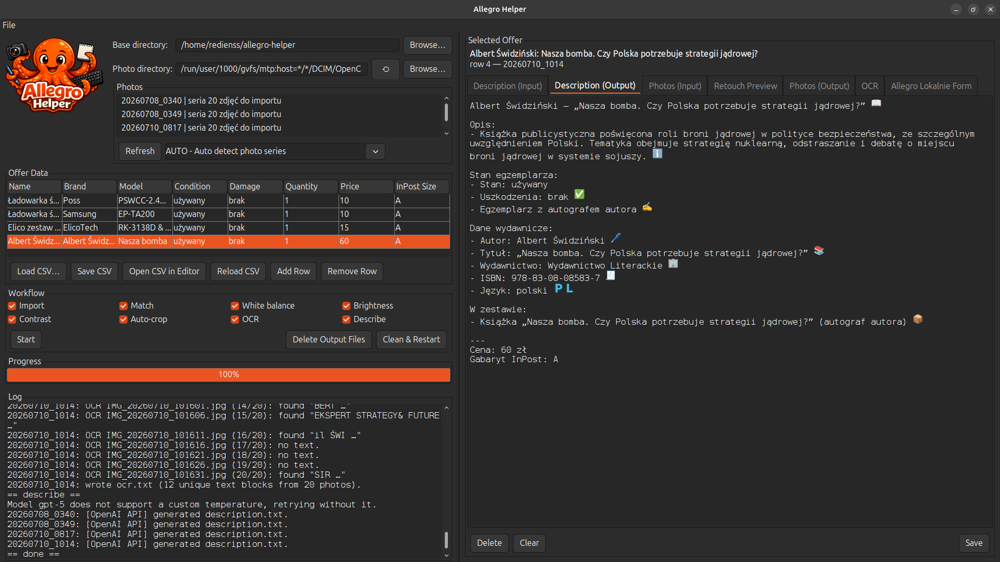
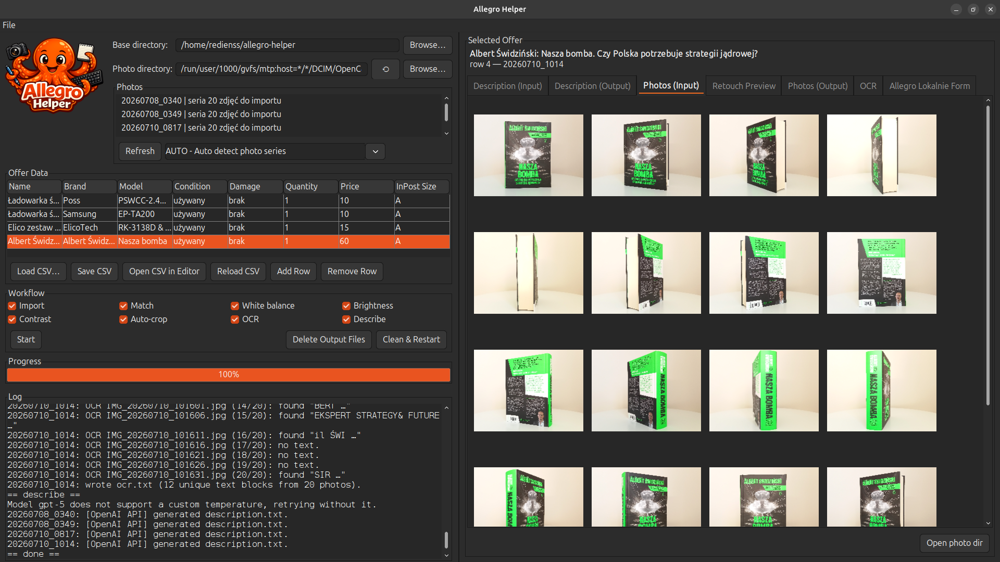
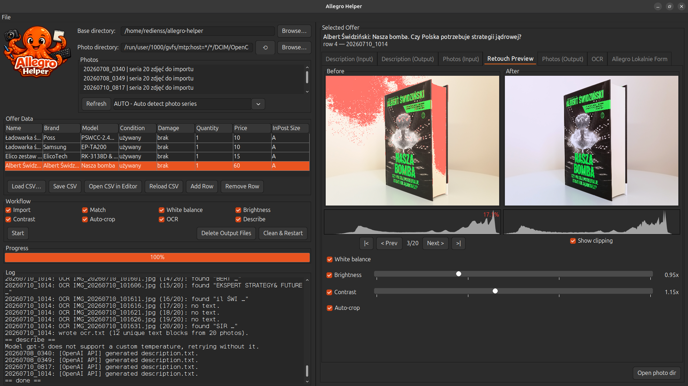
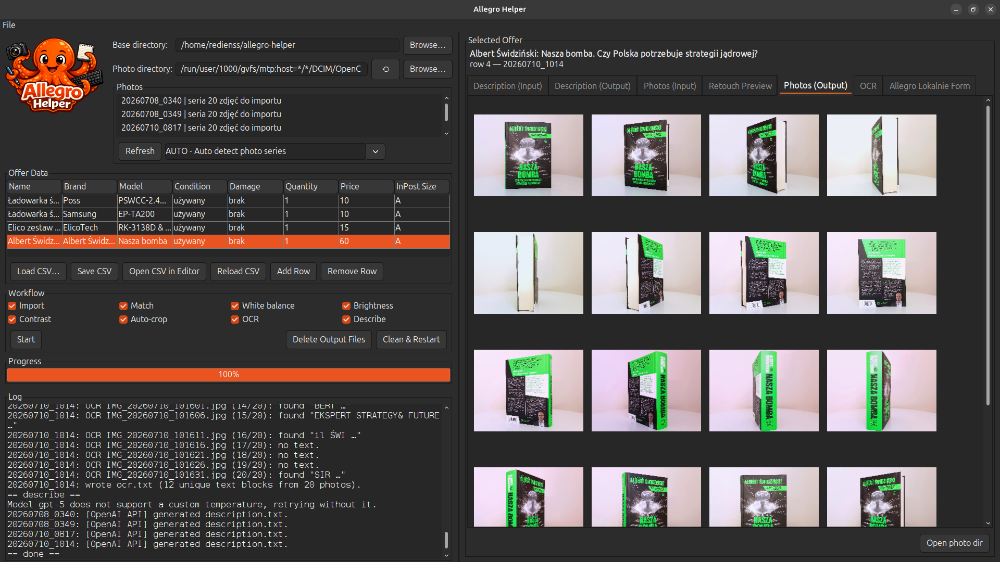
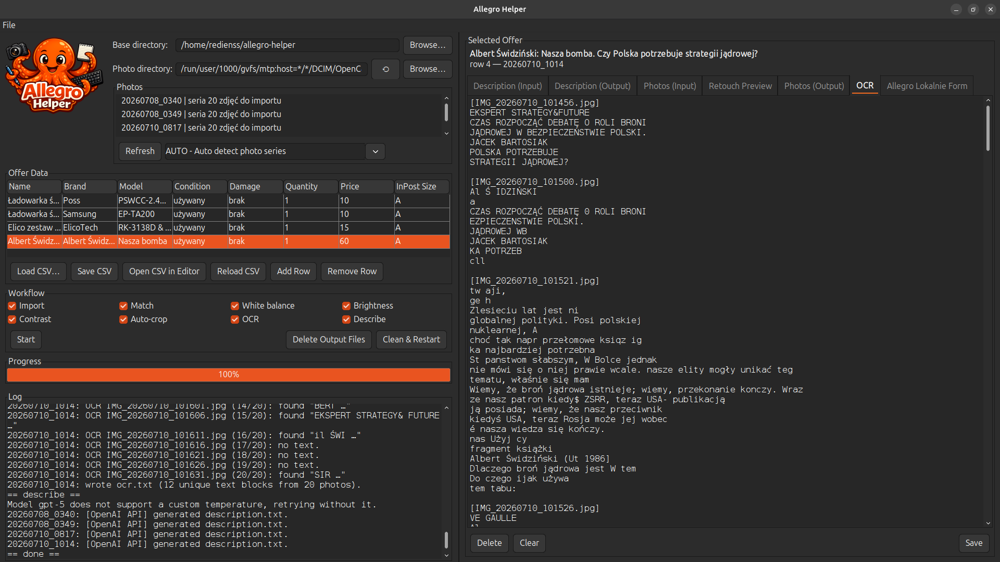
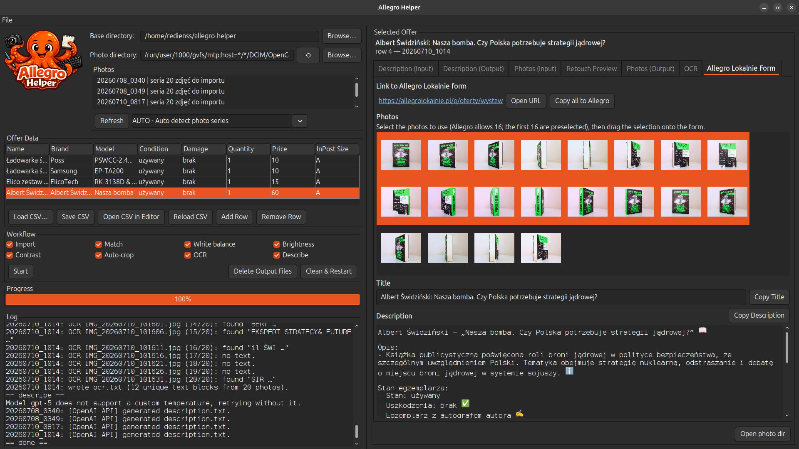

# Allegro Helper

<p align="center">
  
</p>

A Java desktop application that helps sell off private items on **Allegro
Lokalnie**. It automates the workflow from taking photos to writing offer
descriptions, as far as Allegro's rules allow.

It is a *helper*, not a bot — it does not click on Allegro. Publishing the
listing stays manual.

The project itself (code, docs, log output) is in English. The OpenAI prompt and
the generated offer text stay in Polish, since Allegro Lokalnie is a Polish
marketplace.

## The workflow

1. Item photos are taken on a rotating turntable, controlled by a remote, with a
   phone on a tripod running **OpenCamera** — a series of 20 photos, one every
   5 seconds.
2. **Import** — photos are copied from the phone (mounted via MTP) into
   `raw_photos/`. The originals stay on the phone.
3. **Match** — photos are grouped into series and matched to the rows of
   `offers.csv`, one series per row, in order. Each series is moved into its
   own offer directory, e.g. `offers/20260708_0340/`. How the series are
   recognized is selectable in the Photos section (see below): by the
   timestamps in the filenames (the default, made for the turntable workflow),
   the whole directory as one item, or one item per subfolder.
4. **White balance** — automatic gray-world white balance.
5. **Brightness** — brightness by a strength you set on the Retouch Preview
   tab's slider (`1.00x` leaves the photo as it is, less darkens it, more
   brightens it; the default is `1.00x`, i.e. off until you dial it).
6. **Contrast** — contrast by a strength you set on the Retouch Preview tab's
   slider (`1.00x` leaves the photo as it is, less flattens it, more deepens
   it; the default is `1.20x`). Each retouching step works on the output of the
   latest one before it that has run, on the originals otherwise.
7. **Auto-crop** — each series is cropped to the item. Because the item rotates
   on the turntable while the background and table stay still, the item is
   simply the part of the frame that changes across the series. That is what the
   step measures, so it works even for a white item on a light background, where
   brightness thresholding and edge detection both fail. One crop box is used
   for the whole series (the item does not jump between frames), grown by a
   small margin and kept at the source aspect ratio. Works on the most
   processed photos available — contrasted, brightened, white-balanced, or the
   originals when no retouching step has run. Results go to `cropped/`; the
   input photos are left untouched.
8. **OCR** — the text visible on the item and its packaging (labels,
   nameplates, model numbers) is read off the finished photos into `ocr.txt`,
   using the [tesseract](https://github.com/tesseract-ocr/tesseract) CLI —
   free and local, no API cost. Tesseract expects scans rather than photos, so
   each frame is upscaled and OCRed both upright and upside down (an item often
   stands with its label upside down to the camera), the higher-confidence
   reading wins, and low-confidence noise is dropped. Results are logged and
   appended to `ocr.txt` photo by photo, so the log always shows what is being
   worked on.
9. **Describe** — an offer description is generated per offer via the OpenAI
   API, including the price taken directly from the CSV. The recognized OCR
   text rides along in the request, so exact model designations and nameplate
   parameters make it into the description.
10. The offer is then created on Allegro Lokalnie by hand, using the cropped
   photos and the generated description.

Every step is safe to re-run — already processed offers and photos are skipped.

Auto-crop is deliberately cautious. If the series is too short to show movement,
the detected item is implausibly small, or the crop would keep nearly the whole
frame, it says so in the log and leaves that offer uncropped rather than
cropping it wrongly. It reports the box it settled on:

```
== auto-crop ==
20260708_0340: cropped 20 photos to 2225x1669.
20260708_0349: cropped 20 photos to 2210x1658.
```

OCR reports every photo as it goes, with a peek at what it found:

```
== ocr ==
20260710_1014: OCR IMG_20260710_101556.jpg (13/20): found "NASZA BOMBA"
20260710_1014: OCR IMG_20260710_101606.jpg (15/20): found "EKSPERT STRATEGY&FUTURE …"
20260710_1014: OCR IMG_20260710_101616.jpg (17/20): no text.
20260710_1014: wrote ocr.txt (12 unique text blocks from 20 photos).
```

### What stays manual

- Shooting the photos (the turntable and remote are only semi-automatic).
- Filling in `offers.csv` (e.g. the item model), so a sensible description can
  be generated.
- Publishing the offer on Allegro Lokalnie.

## The window

The window is split into two equal-width halves: controls on the left, the
selected offer on the right.



### Menu bar

- **File > Settings…** — a PhpStorm-style settings dialog (page list on the
  left, the selected page on the right), with three pages:
  - **Appearance** — the theme: **System** (the platform look and feel,
    following the desktop theme — the default), **Dark**, or **Light** (both
    built on the JDK's own Nimbus look and feel, keeping the app
    dependency-free).
  - **Language** — the UI language: **English** (the default) or **Polish**.
    The whole window is translated on the spot (texts drawn at runtime, like an
    already-loaded photo list, catch up on their next refresh; the pipeline log
    stays English).
  - **OpenAI API** — what the Describe step talks to: the **API key** (masked;
    with a link to OpenAI's key page if you don't have one yet), the **model**,
    and the two **prompts**. The system prompt is the instruction the model
    works under — the shipped one is in Polish, and it is where the rules live
    that keep a generated description honest (the per-item fields come only from
    the CSV row, never invented; general product specs may be added only when the
    brand and model make them certain). The user prompt is a template whose
    `{{OFFER_JSON}}` placeholder is replaced with the offer's data. Both start
    from the built-in defaults and can be edited freely; **Apply** writes what
    differs from the defaults back to `.env`.

  Every setting takes effect immediately, no restart, and is remembered across
  launches.
- **File > Exit** — closes the app, same as the window's close button.



### Left: controls

- **Base directory** / **Photo directory** — where the app works and where the
  photos come from. The photo directory defaults to the phone's OpenCamera
  directory (via MTP) but can point anywhere — useful when someone else's
  phone mounts under a different path, or for a local folder of photos. The
  **⟲** button restores the default; picking a directory rescans the Photos
  list.
- **Photos** — photo series detected in the photo directory (before import),
  e.g. `20260708_0340 | 20x series of photos to import`. Scanned automatically
  on launch; click **Refresh** to rescan. The dropdown next to it selects how
  the series are recognized, both for this list and for the Match step:
  - **AUTO - Auto detect photo series** (default) — grouped by the timestamps
    in the OpenCamera filenames; a gap longer than
    `SERIES_GAP_THRESHOLD_SECONDS` starts a new series. Made for the
    turntable workflow.
  - **SINGLE - All photos in the directory as one item** — every photo in the
    directory belongs to one single offer, whatever its name, camera, or
    timestamp. Only the first row of `offers.csv` is used. Useful for listing
    one item photographed from different angles at different times.
  - **SUBFOLDERS - Each subfolder as a separate item** — each subfolder of the photo
    directory holds one offer's photos; subfolders in name order match the
    CSV rows in row order, and the offer directories take the subfolder
    names. Useful when the photos were not taken with the turntable and were
    sorted by hand.
- **Offer Data** — an editable grid (`Name | Brand | Model | Condition | Damage |
  Quantity | Price | InPost Size`). Loaded from `offers.csv` in the base
  directory if present; otherwise empty and fillable by hand. You can also
  **Load CSV…** from anywhere, **Save CSV**, **Open CSV in Editor** (opens the
  file in the system's default `.csv` application, e.g. LibreOffice Calc),
  **Reload CSV** (re-reads the file from disk after such an external edit), and
  add/remove rows.
- **Workflow** — checkboxes `Import`, `Match`, `White balance`, `Brightness`,
  `Contrast`, `Auto-crop`, `OCR`, `Describe` (all checked by default), so any
  subset of the pipeline — including a single retouching step on its own — can
  be run.
- **Start** — runs the selected steps in order. If `Match` is selected, the grid
  is written to `offers.csv` first (that step's input).
- **Delete Output Files** / **Clean & Restart** — delete everything under
  `offers/` (after a confirmation), keeping the sources: the photos on the
  phone, `offers.csv` and the `more_data_<N>.txt` files. **Clean & Restart**
  then presses **Start** for you. Since Match moves photos into `offers/`, a
  full re-run needs the phone connected to re-import them.
- **Progress** — overall progress across the selected steps.
- **Log** — the run log (`== import ==`, `== match ==`, …).

### Right: the selected offer

Clicking a row in the grid shows that offer (resolved by matching the row's name
to each offer's `data.json`, falling back to row position) in seven tabs:

- **Description (Input)** — editor for `more_data_<N>.txt` next to `offers.csv`
  (N = the row's 1-based number): extra free-form notes folded into the
  description by the Describe step. Editable and saveable even before Match.
- **Description (Output)** — editor for `description.txt` in the offer
  directory: the generated description; edit and save to tweak it.
- **Photos (Input)** — thumbnail gallery of the original photos
  (`offers/<id>/photos/`).
- **Retouch Preview** — one of the offer's photos as it is now next to the same
  photo with the retouching steps applied, so you can see what White balance,
  Brightness, Contrast and Auto-crop will do before running them. The
  `[|<] [< Prev] 1/20 [Next >] [>|]` stepper under the photos picks which photo
  of the series to judge them on. The four checkboxes are the Workflow section's,
  mirrored: tick one here and it ticks there too, and the preview re-renders. The
  sliders beside `Brightness` and `Contrast` set those steps' strengths (drag
  them, or scroll the mouse wheel over them), and a run uses whatever they are
  set to — so what the preview shows is what you get. It is a true preview — the
  same code a run uses — and it writes nothing.

  Under each photo is its **luminance histogram**: how many pixels sit at each
  brightness, shadows on the left and highlights on the right. It is what the two
  sliders are steering — Brightness slides the whole shape sideways, Contrast
  spreads or gathers it around its middle — and it shows the thing the photo
  itself hides on a screen: whether the tones have run into either end of the
  scale and flattened. (The curve is scaled by the square root of each count. On a
  turntable shot the pale, unchanging background is one enormous spike, and linear
  bars would flatten the item's own tones into a line along the bottom.)

  Pixels that *have* run into an end are **clipped** — detail no slider can bring
  back, because they are already flat white or flat black. Each histogram reports
  the clipped share at the end it is clipped at, and **Show clipping** marks those
  pixels on the photos themselves, camera-style: red for blown highlights, blue
  for crushed shadows. It is off by default — the marks cover the photo they are
  diagnosing, so they are a thing to reach for when a histogram looks piled
  against an edge.
- **Photos (Output)** — thumbnail gallery of the finished photos: the output of
  the latest step that has run — `offers/<id>/cropped/`, else `contrasted/`,
  else `brightened/`, else `white_balanced/`.
- **OCR** — editor for `ocr.txt` in the offer directory: the text the OCR step
  read off the photos, one block per photo that had any. Fix a misread model
  number here and save before running Describe, and the correction flows into
  the description.
- **Allegro Lokalnie Form** — everything the
  [listing form](https://allegrolokalnie.pl/o/oferty/wystaw) needs, laid out
  for copying: a link to the form, the finished photos in a compact grid
  (the first 16 — Allegro's limit — preselected; adjust the selection and drag
  it onto the form's photo dropzone), and the title and generated description
  with copy-to-clipboard buttons. **Copy all to Allegro** does all of it in
  one go: it opens the form in a Chrome instance the app controls (via the
  DevTools protocol) and fills in the selected photos, the title and the
  description. The app never submits — you review the form, complete the
  category and price, and click "Wystaw" yourself. Chrome runs on a dedicated
  profile (`.chrome-profile/` in the base directory, kept out of git): the
  first time, log in to Allegro in that window and the session sticks for
  later runs.



Thumbnails load upright (EXIF-corrected) off the UI thread; double-click one to
open it in the system image viewer. The Photos tabs have an **Open photo dir**
button in the lower-right.

Photos can be dragged out of any gallery straight into another application —
most usefully onto the photo dropzone of a browser upload form, which receives
them exactly as if they came from a file manager. Ctrl/Shift-click selects
several photos; the drag carries exactly the selected files, and a floating
stack of the dragged thumbnails (with a count badge) follows the pointer, along
with a "copy" cursor.



The Retouch Preview tab is where the retouching gets decided, before a single
file is written. The screenshot below is that judgement being made: photo 3 of
20 of a book, **Show clipping** ticked, and the *original* is 17.1% blown — the
red is the backdrop behind the book, already flat white, detail that a run would
have baked in for good. Brightness pulled back to `0.95x` (with Contrast at
`1.15x`) is enough to bring it under: the After photo has no red left in it, and
its histogram comes away from the right edge. None of that is guesswork about
what a run *might* do — it is the pipeline's own code, on the real photo, and a
run then uses exactly the slider values shown here.



Comparing the two galleries shows what Auto-crop did: the same series, framed to
the item.



The OCR tab shows what was legible on the item. For a book it is practically
the whole back cover — the blurb, the ISBN, the names — which gives Describe
plenty of true, item-specific material to work with.



The last tab collects everything the Allegro Lokalnie listing form needs in one
place: fill the form with one click (**Copy all to Allegro**), or do it by
hand — open the form, drag the selected photos onto it, and copy the title and
description into it.



The Description and OCR tabs have a bottom bar with **Delete** and **Clear** in
the lower-left corner (away from **Save** in the lower-right, to avoid
accidental clicks), all acting on the active tab's file:

- **Save** writes the editor to the file.
- **Clear** empties the editor only — the file is unchanged until you Save.
- **Delete** removes the file from disk (after a confirmation dialog) and clears
  the editor.

Emoji in the descriptions are drawn as color images. Java2D cannot rasterize
color fonts, so the app reads the PNG bitmaps embedded in Noto Color Emoji's
`CBDT`/`CBLC` tables and paints those instead of the monochrome glyph. The
document text is untouched, so saving still writes the original emoji
characters. Without a color emoji font the text falls back to the normal glyphs
(set `ALLEGRO_EMOJI_FONT` to point at one explicitly).

## Requirements

- A JDK (Java 17+; developed and tested on Java 25). No Maven/Gradle and **no
  external dependencies** — only the JDK standard library (Swing,
  `java.net.http`, `javax.imageio`).
- `gio` (GVFS) to read photos from a phone connected via MTP (mounted at
  `/run/user/<uid>/gvfs/mtp:host=...`).
- The `tesseract` CLI for the *OCR* step
  (`sudo apt install tesseract-ocr tesseract-ocr-pol tesseract-ocr-eng`).
  Without it the OCR step aborts with that install hint; the rest of the
  pipeline does not need it.
- An OpenAI API key for the *Describe* step (`OPENAI_API_KEY`), read from the
  environment or a `.env` file in the base directory (see `.env.example`).

## Build & run

```bash
./build.sh        # compiles to build/classes (and build/allegro-helper.jar if the `jar` tool is present)
./run.sh          # launches the desktop UI
```

`build.sh` finds `javac` on `PATH`, then `$JAVA_HOME`, then common JVM install
locations; override with `JAVAC=/path/to/javac ./build.sh` if needed.

### Desktop shortcut

The window/taskbar icon is the app icon
(`icons/AllegroHelper-icon-full-logo-1024.png`), bundled onto the classpath at
build time. To add a launcher to the application menu and Desktop:

```bash
./install-desktop-entry.sh
```

This installs `~/.local/share/applications/allegro-helper.desktop` (plus a copy
on the Desktop) and the icon under the hicolor theme. The launcher sets
`StartupWMClass=AllegroHelper`, which the app advertises as its X11 WM class, so
GNOME shows this icon for the running window too.

### Headless / scripting

The same pipeline runs without a UI:

```bash
./run.sh --cli import      # or match | whitebalance | brightness | contrast | autocrop | ocr | describe | all
./run.sh --cli retouch     # alias: whitebalance + brightness + contrast
./run.sh --cli all /path/to/base-dir
```

## Configuration

The base directory (chosen at the top of the window, default: the launch
directory) determines `offers.csv`, `raw_photos/` and `offers/`. These
environment variables are honored, from the environment or `.env`:
`CSV_PATH`, `RAW_PHOTOS_DIR`, `OFFERS_DIR`, `MTP_GLOB_PATTERN`,
`PHOTOS_PER_OFFER`, `SERIES_GAP_THRESHOLD_SECONDS`, `SERIES_RECOGNITION`
(`auto` | `single` | `subfolders`, the CLI equivalent of the series
recognition dropdown), `BRIGHTNESS_STRENGTH` and `CONTRAST_STRENGTH` (the CLI
equivalents of the two sliders: `0.5`–`2.0`, default `1.0` and `1.2`),
`OCR_LANGUAGES` (tesseract languages, default `pol+eng`), `OPENAI_API_KEY`, `OPENAI_MODEL`, `OPENAI_BASE_URL` (for an
OpenAI-compatible endpoint), `CHROME_BIN` and `CHROME_PROFILE_DIR` (the
browser and profile used by **Copy all to Allegro**; by default Chrome is
found on the PATH and the profile lives in `.chrome-profile/` under the base
directory). A real environment variable takes precedence over
a value in `.env`; the **Photo directory** field, the series recognition
dropdown and the two strength sliders in the window take precedence over both.

## Data layout

### `offers.csv`

Tab-delimited. Rows must be in the same order in which the photo series were
taken. Values stay in Polish, since that's the language of the actual listings.

| column | description | example |
|---|---|---|
| name | full offer name | Ładowarka ścienna Poss PSWCC-2.4WH-18 typu C – biała |
| brand | product brand | Poss |
| model | product model | PSWCC-2.4WH-18 |
| condition | item condition | używany |
| damage | description of damage/defects | brak |
| quantity | number of units | 1 |
| price | price in PLN | 10 |
| inpost_size | InPost locker size | A |

### Optional extra notes (`more_data_<N>.txt`)

For information too long or unstructured for a CSV column (test results, usage
history, what's included, …), place `more_data_1.txt`, `more_data_2.txt`, … next
to `offers.csv` — the number matches the 1-based row order. During **Match**
each is copied into the matching offer directory as `more_data.txt`, and
**Describe** passes it to OpenAI as truthful, item-specific notes to be folded
into the description (reformatted or shortened, never embellished with invented
details).

### Source photos

Phone (Samsung, MTP):
`mtp://SAMSUNG_SAMSUNG_Android_R58R301MAHN/Internal storage/DCIM/OpenCamera`

A different phone (or a plain local directory) goes into the **Photo
directory** field at the top of the window — the default value is the glob
that finds the OpenCamera directory on whatever phone is mounted.

Filenames follow the OpenCamera convention `IMG_YYYYMMDD_HHMMSS.jpg`. Photos
within one series are ~5 seconds apart, with a noticeably longer gap between
series (time to swap the item on the turntable) — which is how series boundaries
are detected.

### Output

For each offer a directory `offers/<YYYYMMDD_HHMM>/` is created (timestamp of
the series' first photo):

```
offers/20260708_0340/
  data.json        # data from the CSV row + list of photos
  photos/          # original photos of the series
  white_balanced/  # photos after auto white balance
  brightened/      # photos after the Brightness step
  contrasted/      # photos after the Contrast step
  cropped/         # retouched photos cropped to the item (Auto-crop)
  more_data.txt    # optional, copied from more_data_<N>.txt if present
  ocr.txt          # text read off the photos (OCR), editable in the OCR tab
  description.txt  # generated description + price (from the CSV)
```

(Offers processed before the retouch step was split in two have a single
`retouched/` directory instead; it is still recognized everywhere, just no
longer written.)

## License

Free for any **noncommercial** use — personal use, hobby projects, study, and
research. You may read, run, modify, and share it on those terms.

**Commercial use requires a separate license.** To use Allegro Helper
commercially, contact Tomasz Szneider <redienss@gmail.com>.

See [LICENSE.md](LICENSE.md) for the full terms
([PolyForm Noncommercial License 1.0.0](https://polyformproject.org/licenses/noncommercial/1.0.0)).
